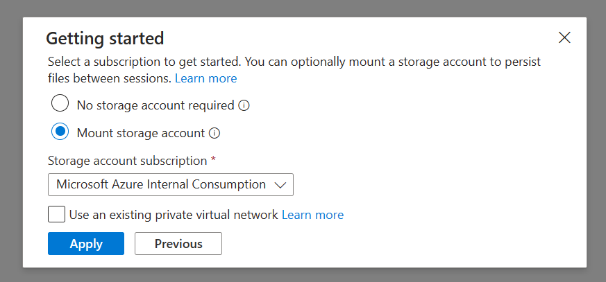
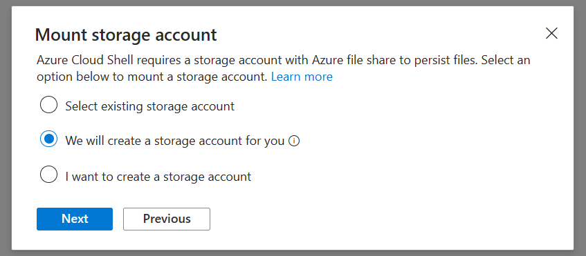

# ExpressDeployment

1. Open Azure Cloud Shell:

   
    https://shell.azure.com/

   Configure it if you use the shell at the first time:

   

   

2. In Cloud Shell command window, run this command to find your target subscription id:

    ```
    az account list --output table
    ```
Copy the target subscription id.

2. Copy code from the [ExpressDeployment.ps1](https://github.com/freistli/ExpressDeployment/blob/main/ExpressDeployment.ps1), and configure these parameters:

    ```
    $baseName = "NewResourceName"
    $subscriptionId = "TargetAzureSubscriptionID"
    $deployUrl = "DeployZipUrl"
    $funcitonUrl = "FunctionZipUrl"
    ```

3. Copy and Past the code into Cloud Shell, run it.
